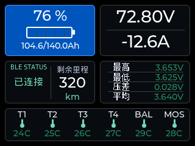
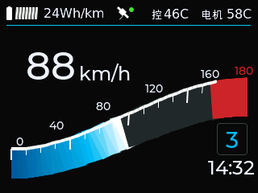
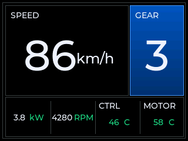
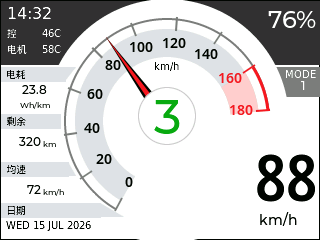

<h1 align="center">⚡ ESP32 BMS GPS 🛰️</h1>

<p align="center">
  <a href="./README.md">简体中文</a>
  ·
  <a href="./README.en.md">English</a>
</p>

ESP32 smart dashboard firmware for electric motorcycles, e-bikes, and light vehicles. It brings BMS, motor-controller, GPS, touchscreen, device hotspot, Web control, and phone casting into one system.

> The project is under active development and hardware validation. The core firmware and primary interaction paths are usable; OTA, track storage, and some hardware compatibility work are not complete.

<h2 align="center">🖼️ UI Preview</h2>

<table align="center">
  <tr>
    <th>Device Settings Home</th>
    <th>Live BMS Data</th>
  </tr>
  <tr>
    <td align="center">
      <br>
      <sub>System settings, brightness, volume, slider position, and screen calibration</sub>
    </td>
    <td align="center">
      <br>
      <sub>76% SOC, 72.8 V, -12.6 A, remaining range, and cell voltages</sub>
    </td>
  </tr>
  <tr>
    <th>BMW S1000RR Dashboard</th>
    <th>Controller Data</th>
  </tr>
  <tr>
    <td align="center">
      <br>
      <sub>88 km/h, 24 Wh/km, gear 3, controller and motor temperatures</sub>
    </td>
    <td align="center">
      <br>
      <sub>86 km/h, gear 3, 3.8 kW, 4280 RPM, and temperatures</sub>
    </td>
  </tr>
  <tr>
    <th colspan="2">Honda Fireblade Dashboard</th>
  </tr>
  <tr>
    <td align="center" colspan="2">
      <br>
      <sub>88 km/h, 76% SOC, gear 3, power, temperatures, and range information</sub>
    </td>
  </tr>
</table>

## 🌐 Online Control Page

<p align="center">
  <strong>🌐 <a href="https://esp-bms-setting.vercel.app/">Open the Vercel Control Page</a></strong>
</p>

To control the device through its hotspot API:

1. Enable the device hotspot in TFT settings and view its QR code, SSID, and password.
2. Connect the phone or computer to that hotspot.
3. Open the control page, allow local-network access, and connect to `http://192.168.4.1`.

The control page is Chinese-first and can switch to English. The hotspot HTTP API is the primary working transport. A Web Bluetooth entry also exists, but it requires the matching firmware-side BLE control service. The `/cast` path launches the Android casting app.

## 🎯 Project Goals and Development Progress

| Goal | Development progress | Status |
| --- | --- | :---: |
| 🖥️ Provide glanceable speed, BMS, controller, and GPS dashboards on a TFT | Profiles select ST7789/XPT2046, ILI9488/FT6336U, or ST7796U/GT1151; LVGL dashboards, rotation, brightness, touch calibration, and the quick panel are integrated | 🚧 Being refined |
| 🔋 Connect to battery protection boards used across two-wheel vehicle platforms over BLE, with all telemetry coming from real devices | ANT BMS scanning, binding, connection, subscription, polling, and status-frame parsing are implemented and hardware-tested; other brands and models await adaptation and validation | 🚧 ANT tested; others pending |
| 🛞 Connect to FarDriver controllers over BLE and accurately convert vehicle parameters | BLE protocol, real telemetry, tire parameters, and gear-ratio conversion are integrated; device compatibility and data calibration continue | 🚧 Being refined |
| 🛰️ Provide GPS positioning, speed, time synchronization, track recording, and maps | 336H UART NMEA, RMC speed/fix/UTC, and profile-configured PPS diagnostics are integrated; track storage and maps are not complete | 🚧 Core path available |
| 📡 Support configuration, diagnostics, and maintenance through the Setup AP, embedded Web UI, and public HTTPS control page | Random hotspot credentials, QR code, `192.168.4.1`, configuration APIs, and BMS scan/bind entry points are integrated; the Vercel control page is live | ✅ Implemented |
| 🔊 Provide clear audio feedback for connection state and device actions | Classic ESP32 uses DAC and ESP32-S3 uses I2S; amplifier and audio pins come from the selected profile | ✅ Implemented |
| 📱 Extend maps, navigation, and complex views through low-latency Android casting | A standalone Kotlin app and casting protocol exist; latency, stability, and device compatibility are being refined | 🚧 In development |
| 🌏 Use Chinese by default and provide an English switch in device settings | The Chinese-first UI and settings-based language policy are defined; the TFT uses ASCII `ZH` / `EN` language markers | 🚧 In progress |
| 🔄 Complete the OTA, TF-card recording, track history, and map workflow | OTA does not yet provide a complete upgrade loop; TF-card recording, track history, and maps are planned for later phases | ⏳ Pending |

“Implemented” means the code path exists; it does not mean every target hardware combination has completed long-duration validation.

## 🧩 Target Hardware and GPIO Configuration

- Classic ESP32: ESP32-WROOM-32E, 4 MB Flash, no PSRAM, with optional ST7789/XPT2046 and DAC audio.
- ESP32-S3: I80 ILI9488/FT6336U and I80 ST7796U/GT1151 profiles, each with its own Flash, PSRAM, and GPIO contract.
- GPS: 336H UART NMEA plus PPS; its GPIO roles are generated and validated only when the GPS module is selected.
- BMS: ANT BMS BLE has been hardware-tested; boards from other two-wheel platforms await adaptation and validation. The controller protocol is FarDriver BLE.

Hardware and GPIO assignments are not duplicated in the README or C source. The configuration chain is:

- Board, display, touch, and module facts: [`firmware/catalog`](./firmware/catalog)
- Saved selection and GPIO overrides: `firmware-builds/<profile>/firmware.env`
- Generated C/CMake configuration: `firmware-builds/<profile>/generated/`
- Generic display bridge, GPS, ADC, and audio components consume only generated configuration
- Full pin map, conflicts, and build contract: [`hardware-build-flash.md`](./.trellis/spec/backend/hardware-build-flash.md)

When a GPIO changes, update verified catalog data or an explicit profile override and regenerate. Do not update the README alone or add a source-code fallback pin.

## 🛠️ Development Stack

| Layer | Technology |
| --- | --- |
| Firmware | C, ESP-IDF 6.0.2, FreeRTOS, CMake / `idf.py` |
| Display | LVGL 9.5, `esp_lvgl_adapter`, `esp_lcd`, ST7789/XPT2046, ILI9488/FT6336U, ST7796U/GT1151 |
| Device services | NimBLE, Wi-Fi SoftAP, `esp_http_server`, NVS, UART NMEA, ADC, LEDC, DAC, I2S |
| Embedded Web | Single-page HTML / CSS / vanilla JavaScript embedded in the firmware image |
| Vercel control page | React 19, TypeScript, Vite 6, Vercel |
| Android casting | Kotlin, Android SDK 35, Java 17, Gradle 8.14.2 |
| Quality and workflow | GitNexus, Trellis, host protocol self-tests, ESP-IDF builds, and hardware logs |

Dependency versions, partitions, diagnostic images, and platform build commands are defined in the [project build contract](./.trellis/spec/backend/hardware-build-flash.md).

## 🚀 Configure, Build, and Flash

`start.sh` (Linux/macOS) and `start.cmd` (Windows) are the unified firmware configurator. Run `doctor` first; running without arguments starts guided configuration. `--dashboards` accepts `s1000rr`, `controller`, or `fireblade`, and `--modules` includes only the modules you need.

Linux/macOS:

```bash
# Check the environment; use install-idf for a first ESP-IDF 6.0.2 setup
./start.sh doctor
./start.sh install-idf --dir /home/USER/esp/esp-idf-v6.0.2

# Guided configuration, or validate/save a Fireblade + BMS + controller profile
./start.sh
./start.sh validate --profile fireblade --modules bms,controller --dashboards fireblade
./start.sh configure --profile fireblade --modules bms,controller --dashboards fireblade

# Write the profile and build in an isolated directory; cloud builds only dispatch a workflow
./start.sh build-local --profile fireblade --modules bms,controller --dashboards fireblade
./start.sh build-cloud --profile fireblade --modules bms,controller --dashboards fireblade
```

On Windows, use the same arguments with `.\start.cmd`, for example `.\start.cmd doctor`, `.\start.cmd`, or `.\start.cmd build-local --profile fireblade --modules bms,controller --dashboards fireblade`. For a first setup, run `.\start.cmd install-idf --dir C:\esp\esp-idf-v6.0.2`. The project wrapper reloads and verifies the saved ESP-IDF path automatically.

Linux local serial:

```bash
./scripts/esp-idf-env.sh -p /dev/ttyUSB0 flash monitor
```

Windows local serial:

```powershell
.\scripts\flash.ps1 -Port COM3 -Monitor
```

Interactive flashing defaults to a local serial port; remote RFC2217 requires an explicit selection and URL.

Erase Flash once when switching from a different partition table. See the [firmware hardware, build, and flash contract](./.trellis/spec/backend/hardware-build-flash.md) for build-only commands, erase flow, diagnostic images, partition layout, and troubleshooting.

## 📁 Repository Layout

```text
main/                         Boot entry point and embedded Web UI
components/                   Runtime, display bridge, LVGL UI, protocol, and audio components
android-cast/                 Android low-latency casting app
vercel/                       Standalone Vercel control-page frontend
scripts/                      Build, flash, serial bridge, and diagnostic tools
tests/                        Host-runnable protocol and logic self-tests
.trellis/spec/                Project engineering specifications and executable contracts
img/                          Other README images
preview/                      UI preview scripts and current tracked README screenshots
```

`main/idf_main.c` owns boot orchestration only. Hardware, protocol, state, and UI logic belong in focused ESP-IDF components.

## 📄 License

This project is available under the [PolyForm Noncommercial License 1.0.0](./LICENSE). You may use, modify, and distribute it only for noncommercial purposes. Commercial use requires separate written permission from the copyright holder.
