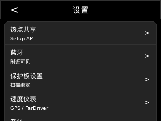
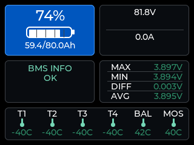
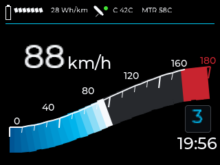
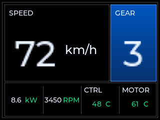

<h1 align="center">⚡ ESP32 BMS GPS 🛰️</h1>

<p align="center">
  <a href="./README.md">简体中文</a>
  ·
  <a href="./README.en.md">English</a>
</p>

面向电摩、电动车与轻型车辆的 ESP32 智能仪表固件：在一块设备上整合 BMS、控制器、GPS、触摸屏、设备热点、Web 控制和手机投屏。

> 当前项目处于持续开发与实机联调阶段。核心固件和主要交互链路已经可用，OTA、轨迹存储及部分硬件兼容性仍未完成。

<h2 align="center">🖼️ 界面预览</h2>

<p align="center">下列 README 图片存放在可跟踪的 <code>img/</code> 目录；本地渲染过程文件仍保存在被 Git 忽略的 <code>preview/</code> 目录。</p>

<table align="center">
  <tr>
    <th>设备设置首页</th>
    <th>BMS 数据</th>
  </tr>
  <tr>
    <td align="center">
      <br>
      <sub>系统设置、亮度、音量、调节条位置与屏幕校准</sub>
    </td>
    <td align="center">
      <br>
      <sub>74% SOC、81.8 V、0.0 A、单体电压与温度</sub>
    </td>
  </tr>
  <tr>
    <th>BMW S1000RR 风格仪表</th>
    <th>控制器数据</th>
  </tr>
  <tr>
    <td align="center">
      <br>
      <sub>88 km/h、28 Wh/km、3 挡、控制器与电机温度</sub>
    </td>
    <td align="center">
      <br>
      <sub>72 km/h、3 挡、8.6 kW、3450 RPM 与温度</sub>
    </td>
  </tr>
</table>

## 🌐 在线控制网站

<p align="center">
  <strong>🌐 <a href="https://esp-bms-setting.vercel.app/">打开 Vercel 控制站</a></strong>
</p>

使用热点 API 控制设备：

1. 在 TFT 设置中打开设备热点并查看二维码、SSID 和密码。
2. 手机或电脑连接该热点。
3. 打开上面的控制网站，允许浏览器访问本地网络，然后连接 `http://192.168.4.1`。

控制站默认中文，可切换英文。目前热点 HTTP API 是主要可用链路；页面也包含 Web Bluetooth 入口，但需要固件侧 BLE 控制服务配合。`/cast` 路径用于唤起 Android 投屏应用。

## 🎯 项目目标与开发进度

| 目标 | 开发进度 | 状态 |
| --- | --- | :---: |
| 🖥️ 用 240 × 320 TFT 提供适合骑行的速度、BMS、控制器和 GPS 仪表 | ST7789、XPT2046、LVGL 仪表与设置、旋转、亮度、触摸校准和快捷面板均已接入 | 🚧 持续优化 |
| 🔋 通过 BLE 接入各两轮平台的电池保护板，所有遥测均来自真实设备 | ANT BMS 已完成扫描、绑定、连接、订阅、轮询和状态帧解析并通过实测，其他品牌与型号的保护板待适配验证 | 🚧 ANT 已实测，其他待测 |
| 🛞 通过 BLE 接入远驱控制器并准确换算车辆参数 | 已接入 BLE 协议、真实遥测、轮胎参数和传动比换算，继续完善设备兼容与数据校准 | 🚧 持续优化 |
| 🛰️ 提供 GPS 定位、速度、授时、轨迹记录和地图能力 | 已接入 336H UART NMEA、RMC 速度/定位/UTC 和 GPIO35 PPS 诊断，轨迹与地图尚未完成 | 🚧 基础链路可用 |
| 📡 通过 Setup AP、本地 Web UI 和公网 HTTPS 控制站完成配置、诊断与维护 | 随机热点凭据、二维码、`192.168.4.1`、配置 API 和 BMS 扫描/绑定入口已接入；Vercel 控制站已上线 | ✅ 已实现 |
| 🔊 为连接状态和设备操作提供清晰的音频反馈 | GPIO26 DAC 与 GPIO4 功放使能已用于连接提示和音量反馈 | ✅ 已实现 |
| 📱 通过 Android 低延迟投屏扩展地图、导航与复杂信息展示 | 独立 Kotlin 应用和投屏协议已建立，正在优化延迟、稳定性与机型兼容 | 🚧 开发中 |
| 🌏 默认使用中文，并在设备设置中提供英文切换 | 中文默认界面与设置内语言切换策略已经确定，TFT 语言状态使用 ASCII `ZH` / `EN` 标记 | 🚧 持续完善 |
| 🔄 建立 OTA、TF 卡记录、历史轨迹和地图的完整闭环 | OTA API 尚未形成完整升级闭环，TF 卡记录、历史轨迹和地图属于后续阶段 | ⏳ 待实现 |

“已实现”表示代码路径已经接入，不等同于所有目标硬件组合都已完成长期验证。

## 🧩 目标硬件与 GPIO 配置位置

- MCU：ESP32-WROOM-32E，4 MB Flash，不使用 PSRAM。
- 屏幕：TPM408 2.8 英寸，ST7789，240 × 320，BGR。
- 触摸：XPT2046 / XP2046。
- GPS：336H，UART NMEA + PPS。
- BMS：已实测 ANT BMS BLE；其他两轮平台保护板待适配验证；控制器协议为远驱 BLE。

GPIO 不在 README 中重复维护，代码中的配置位置如下：

- 显示、触摸、背光：[`components/esp_bms_lvgl_bridge/include/esp_bms_lvgl_bridge.h`](./components/esp_bms_lvgl_bridge/include/esp_bms_lvgl_bridge.h)
- GPS、PPS、本机电池 ADC：[`components/esp_bms_idf_runtime/esp_bms_idf_runtime.c`](./components/esp_bms_idf_runtime/esp_bms_idf_runtime.c)
- 音频 DAC 与功放使能：[`components/esp_bms_audio_feedback/esp_bms_audio_feedback.c`](./components/esp_bms_audio_feedback/esp_bms_audio_feedback.c)
- 完整引脚表、冲突说明与构建约定：[`hardware-build-flash.md`](./.trellis/spec/backend/hardware-build-flash.md)

修改 GPIO 时必须同步修改对应代码配置和项目规范，不能只改 README。

## 🛠️ 开发栈

| 层 | 技术 |
| --- | --- |
| 固件 | C、ESP-IDF 5.5.x（当前开发环境 5.5.4）、FreeRTOS、CMake / `idf.py` |
| 显示 | LVGL 9.5、`esp_lvgl_adapter`、`esp_lcd`、ST7789、XPT2046 |
| 设备能力 | NimBLE、Wi-Fi SoftAP、`esp_http_server`、NVS、UART NMEA、ADC、LEDC、DAC |
| 嵌入式 Web | 单页 HTML / CSS / Vanilla JavaScript，编译进固件镜像 |
| Vercel 控制站 | React 19、TypeScript、Vite 6、Vercel |
| Android 投屏 | Kotlin、Android SDK 35、Java 17、Gradle 8.14.2 |
| 质量与协作 | GitNexus、Trellis、主机协议自测、ESP-IDF 构建与实机日志 |

依赖版本、分区、诊断构建和各平台构建命令以[项目构建规范](./.trellis/spec/backend/hardware-build-flash.md)为准。

## 🚀 如何烧录

准备 ESP-IDF 5.5.x；仓库脚本会优先加载 `$IDF_PATH/export.sh`，否则尝试 `$HOME/esp/esp-idf-v5.5.4/export.sh`。

Linux 本地串口：

```bash
./scripts/esp-idf-env.sh -p /dev/ttyUSB0 flash monitor
```

Windows 本地串口：

```powershell
.\scripts\flash.ps1 -Port COM3 -Monitor
```

如果设备此前使用其他分区表，首次切换时需要先擦除 Flash。详细的构建、擦除、诊断镜像、分区布局和故障排查见[固件硬件、构建与烧录规范](./.trellis/spec/backend/hardware-build-flash.md)。

## 📁 目录结构

```text
main/                         启动入口与嵌入式 Web UI
components/                   运行时、显示桥接、LVGL UI、协议与音频组件
android-cast/                 Android 低延迟投屏应用
vercel/                       独立的 Vercel 控制站前端
scripts/                      构建、烧录、串口桥接与诊断脚本
tests/                        可在主机运行的协议/逻辑自测
.trellis/spec/                项目工程规范与可执行约定
img/                          README 使用并随仓库提交的图片
preview/                      本地 UI 渲染脚本与过程预览（Git 忽略）
```

`main/idf_main.c` 只负责启动编排；硬件、协议、状态和 UI 逻辑应放在对应 ESP-IDF 组件中。

## 📄 许可

本项目采用 [PolyForm Noncommercial License 1.0.0](./LICENSE)。仅允许用于非商业目的；任何商业使用均需事先获得版权持有人的单独书面授权。
